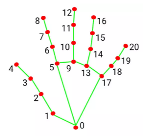

# python

建立時間: 2025年10月1日 下午5:22

- 鏡頭設置
    
    ```python
    import cv2                      # OpenCV：處理攝影機與畫面顯示
    #打開預設攝影機（0 = 內建鏡頭；如果外接另一顆，可能要用 1 或 2）
    cap = cv2.VideoCapture(0)
    while True:
        ok, frame = cap.read()   # 4) 讀取攝影機畫面
        if not ok:
            break                # 抓不到就離開（例如鏡頭被占用）
        ##接下來的code寫在這裡下面
        #  MediaPipe 要吃 RGB，所以先把 BGR → RGB
        rgb = cv2.cvtColor(frame, cv2.COLOR_BGR2RGB)
    ```
    
- 手部偵測:
    - 參考資料
        
        https://jasonworkshop.com/b20241016/
        
        [Google AI for Developers 手部地標偵測指南  |  Google AI Edge  |  Google AI for Developers](https://ai.google.dev/edge/mediapipe/solutions/vision/gesture_recognizer?hl=zh-tw)
        
        https://hackmd.io/@am534143/r1pch8Y1p
        
    - 樣式
        
        ```python
        #手部節點
        mp_style.get_default_hand_landmarks_style()
        #手部節點連接
        mp_style.get_default_hand_connections_style()
        
        #--------------修改所有節點樣式------------------------
        #color/thickness/circle_radius/opacity/fill_color
        eg.
        	hand_landmarks_style.color = (0, 255, 0)   # 設置顏色為綠色
        	hand_landmarks_style.thickness = 2         # 設置厚度為2
        	hand_landmarks_style.circle_radius = 5     # 設置圓形半徑為5
        
        #--------------修改某個點的樣式------------------------
        eg.
        	tip = hand_landmarks.landmark[8]
          px, py = int(tip.x * w), int(tip.y * h)         # 轉為像素座標（整數），方便畫圓點
          cv2.circle(frame, (px, py), 8, (0, 255, 0), -1) # 在食指尖端畫一個綠色小圓點 (8半徑)
                    
        ```
        
        
        
        ```python
        import mediapipe as mp
        
        # 初始化 MediaPipe
        mp_hands = mp.solutions.hands
        mp_draw = mp.solutions.drawing_utils
        mp_style = mp.solutions.drawing_styles
        
        # 獲取默認樣式並修改顏色
        hand_landmarks_style = mp_style.get_default_hand_landmarks_style()
        hand_connections_style = mp_style.get_default_hand_connections_style()
        
        # 設置節點顏色為藍色
        hand_landmarks_style.color = (0, 0, 255)  # 藍色 (BGR 格式)
        
        # 設置連接顏色為紅色
        hand_connections_style.color = (255, 0, 0)  # 紅色 (BGR 格式)
        
        # 使用自訂樣式繪製手部標記和連接
        mp_draw.draw_landmarks(
            frame,
            hand_landmarks,
            mp_hands.HAND_CONNECTIONS,
            hand_landmarks_style,
            hand_connections_style
        )
        # 改變單一點樣式
        tip = hand_landmarks.landmark[8]
        px, py = int(tip.x * w), int(tip.y * h)  
        cv2.circle(frame, (px, py), 8, (0, 255, 0), -1) 
        ```
        
    - demo
        
        ```python
        # 目的：打開你的攝影機 → 用 MediaPipe 偵測手部 → 把 21 個關節點畫到畫面上
        # 離開鍵：按鍵盤 ESC
        
        import cv2                      # OpenCV：處理攝影機與畫面顯示
        import mediapipe as mp          # MediaPipe：手部偵測套件
        
        # 1) 打開預設攝影機（0 = 內建鏡頭；如果外接另一顆，可能要用 1 或 2）
        cap = cv2.VideoCapture(0)
        
        # 2) 建立 MediaPipe Hands 物件（偵測器）
        #    static_image_mode= *T/F* ：視訊串流模式（False:會持續追蹤，速度快)(True:則每張圖像都會獨立處理)
        #    max_num_hands= *number*：最多手部偵測數量
        #    min_detection_confidence= *number0~1* : 檢測的最低可信度門檻>用在「第一次找到手/臉」的時候。（0~1，越高越嚴格）
        #    min_tracking_confidence= *number0~1* : 追蹤信心值門檻>用在「已經偵測到，接下來持續追蹤」的時候
        hands = mp.solutions.hands.Hands(
            static_image_mode=False, 
            max_num_hands=2,
            min_detection_confidence=0.5,
            min_tracking_confidence=0.5
        )
        
        # 3) 導入繪圖實用工具函數
        mp_draw = mp.solutions.drawing_utils
        mp_style = mp.solutions.drawing_styles
        
        while True:
            ok, frame = cap.read()      # 4) 讀取攝影機畫面
            if not ok:
                break                   # 抓不到就離開（例如鏡頭被占用）
        
            # 5) MediaPipe 要吃 RGB，所以先把 BGR → RGB
            rgb = cv2.cvtColor(frame, cv2.COLOR_BGR2RGB)
        
            # 6) 偵測手部
            result = hands.process(rgb)
        
            # 7) 繪製手部關鍵點和連線
            if result.multi_hand_landmarks:  # 如果有偵測到一隻或多隻手
                h, w, _ = frame.shape # 取得影像尺寸(height,width,channels(如 RGB 通道))
                for hand_landmarks in result.multi_hand_landmarks:
                    # 7-1) 畫出 21 個關節與連線（畫在原本的 BGR 影像 frame 上）
                    mp_draw.draw_landmarks(
                        frame,
                        hand_landmarks,
                        mp.solutions.hands.HAND_CONNECTIONS,
                        mp_style.get_default_hand_landmarks_style(),
                        mp_style.get_default_hand_connections_style()
                    )
                    
                    # 7-2) 例子：取得食指尖端（id=8）的「正規化座標」(0~1)
                    tip = hand_landmarks.landmark[8]
                    # 轉為像素座標（整數），方便畫圓點
                    px, py = int(tip.x * w), int(tip.y * h)
                    # 7-3) 在食指尖端畫一個綠色小圓點  (8半徑)
                    cv2.circle(frame, (px, py), 8, (0, 255, 0), -1)
                    # 7-4) 同時在終端機印出正規化座標（之後要用這對 x,y 傳給 Unity）
                    print(f"index_tip: x={tip.x:.3f}, y={tip.y:.3f}")
                    
                    
                    #練習區:(得到大拇指)大拇指生成白色圓形
                    test=hand_landmarks.landmark[4]
                    ox,oy=int(test.x * w),int(test.y * h)
                    cv2.circle(frame, (ox, oy), 10, (0, 0, 0), -1)
                    
        
            # 8) 顯示畫面視窗
            cv2.imshow("Hand Tracking (ESC to quit)", frame)
        
            # 9) 每 1ms 讀一次鍵盤，若按下 ESC (27) 就離開
            if cv2.waitKey(1) & 0xFF == 27:
                break
        
        # 10) 釋放攝影機並關閉所有視窗
        cap.release()
        cv2.destroyAllWindows()
        
        ```
        
- 臉部偵測:
    - 參考資料
        
        https://steam.oxxostudio.tw/category/python/ai/ai-mediapipe-2023-face-landmark-detection.html
        
        https://chtseng.wordpress.com/2022/03/03/mediapipe_face_mesh%E7%9A%84%E4%BD%BF%E7%94%A8/
        
        [https://ai.google.dev/edge/mediapipe/solutions/vision/face_detector?hl=zh-tw](https://ai.google.dev/edge/mediapipe/solutions/vision/face_detector?hl=zh-tw)
        
    - 單一人臉偵測
        
        ```python
        		if res.multi_face_landmarks:
                # 只取第一張臉（index 0）
                face = res.multi_face_landmarks[0]
        ```
        
    - 多人臉偵測
        
        ```python
        
            if res.multi_face_landmarks:
                # 針對每一張臉逐一處理
                for idx, face in enumerate(res.multi_face_landmarks):
        ```
        
    - 樣式
        
        ```python
        mp_draw.draw_landmarks(
        	image=frame,
        	landmark_list=face,
        	connections=mp.solutions.face_mesh.FACEMESH_TESSELATION,
        	landmark_drawing_spec=None, 
        	connection_drawing_spec=mp_style.get_default_face_mesh_tesselation_style()
        )
        # connections → 要畫哪個部位（例如全臉、眉毛、嘴唇、眼睛…）。
         e.g. 全臉網格 : FACEMESH_TESSELATION
        			眉毛 : FACEMESH_LEFT_EYEBROW  //  FACEMESH_RIGHT_EYEBROW
        			眼睛 : FACEMESH_LEFT_EYE     //   FACEMESH_RIGHT_EYE
        			嘴唇 : FACEMESH_LIPS         
        			臉輪廓 :　FACEMESH_FACE_OVAL
        			虹膜：FACEMESH_IRISES(新版) or FACEMESH_LEFT_IRIS // FACEMESH_RIGHT_IRIS（舊版分開）
        
        # landmark_drawing_spec → 每個點的樣式（None = 用預設）
        	e.g. 
        		landmark_drawing_spec=mp_draw.DrawingSpec(color=(0,255,0), thickness=1, circle_radius=2),   # 綠色小點
        		
        # connection_drawing_spec → 該部位的線條樣式。
        	e.g. 
        		connection_drawing_spec=mp_draw.DrawingSpec(color=(0,0,255), thickness=2, circle_radius=1)  # 紅色線
        
        #### tips:顏色是BGR ####
        ```
        
    - demo
        - 用 MediaPipe FaceMesh 偵測臉 → 以「z 最小」近似鼻尖位置
            
            ```python
            # 目的：攝影機 → 用 MediaPipe FaceMesh 偵測臉 → 以「z 最小」近似鼻尖位置
            # 離開鍵：按鍵盤 ESC
            
            import cv2                      # OpenCV：處理攝影機與畫面顯示
            import mediapipe as mp          
            
            # 1) 打開預設攝影機（0 = 內建鏡頭；如果外接另一顆，可能要用 1 或 2）
            cap = cv2.VideoCapture(0)
            
            # 2) 建立 FaceMesh 偵測器
            #    max_num_faces= *number*    ：表示偵測臉孔數的上限
            #    refine_landmarks=*T/F*     ：True > 增加眼睛/嘴唇等細節點（更精細）
            #    min_detection_confidence=*number0~1*   ：第一次偵測到臉的信心門檻
            #    min_tracking_confidence=*number0~1*    ：已偵測到後，持續追蹤的門檻
            face_mesh = mp.solutions.face_mesh.FaceMesh(
                max_num_faces=2,
                refine_landmarks=True,
                min_detection_confidence=0.5,
                min_tracking_confidence=0.5
            )
            
            # 3)導入繪圖實用工具函數
            mp_draw  = mp.solutions.drawing_utils
            mp_style = mp.solutions.drawing_styles
            
            while True:
                ok, frame = cap.read()   # 4) 讀取攝影機畫面
                if not ok:
                    break                # 抓不到就離開（例如鏡頭被占用）
                
                frame = cv2.flip(frame, 1)            # 鏡像，互動直覺
                
                # 5) MediaPipe 要吃 RGB，所以先把 BGR → RGB
                rgb = cv2.cvtColor(frame, cv2.COLOR_BGR2RGB)
                
                # 6) FaceMesh 偵測
                res = face_mesh.process(rgb)
            
                # 7) 繪製臉部網格
                if res.multi_face_landmarks:
                    h, w, _ = frame.shape   # 取得影像尺寸(height,width,channels(如 RGB 通道))
                    for idx, face in enumerate(res.multi_face_landmarks):
            
                        # 7-1)畫出
                        mp_draw.draw_landmarks(
                            image=frame,
                            landmark_list=face,
                            connections=mp.solutions.face_mesh.FACEMESH_TESSELATION,
                            landmark_drawing_spec=None,
                            connection_drawing_spec=mp_style.get_default_face_mesh_tesselation_style()
                        )
                     
                        # 7-2) 取得「最靠近鏡頭」的點：z 值越小越靠近鏡頭
                        #      每個 landmark 都有 (x, y, z)；x,y 為 0~1 正規化，z 為相對深度
                        nose_lm = min(face.landmark, key=lambda lm: lm.z)
            
                        # 7-3) 正規化座標 → 換算為像素座標，方便在畫面上標記
                        px, py = int(nose_lm.x * w), int(nose_lm.y * h)
            
                        # 7-4) 在估計的鼻尖位置畫一個小圓點（黃色）
                        cv2.circle(frame, (px, py), 6, (0, 255, 255), -1)
            
                        # 7-5) 顯示臉編號（idx）以利區分
                        label = f"Face {idx} nose"
                        cv2.putText(frame, label, (px + 8, py - 8),cv2.FONT_HERSHEY_SIMPLEX, 0.5, (0, 255, 255), 1, cv2.LINE_AA)
                        # 7-6)終端機輸出正規化座標 (0~1) 與相對深度 z
                        print(f"[Face {idx}] nose_tip_norm: x={nose_lm.x:.3f}, y={nose_lm.y:.3f}, z={nose_lm.z:.3f}")
            
                # 8) 顯示畫面視窗
                cv2.imshow("FaceMesh - Nose Tip (ESC to quit)", frame)
                # 9) 每 1ms 讀一次鍵盤，若按下 ESC (27) 就離開
                if cv2.waitKey(1) & 0xFF == 27:
                    break
            
            # 10) 釋放攝影機並關閉所有視窗
            cap.release()
            cv2.destroyAllWindows()
            
            ```
            
        - 用 MediaPipe FaceMesh 偵測臉 → 繪製出眼睛藍色框/嘴唇紅色框
            
            ```python
            # 目的：攝影機 → 用 MediaPipe FaceMesh 偵測臉 → 繪製出眼睛藍色框/嘴唇紅色框
            # 離開鍵：按鍵盤 ESC
            
            import cv2                      # OpenCV：處理攝影機與畫面顯示
            import mediapipe as mp          
            
            # 1) 打開預設攝影機（0 = 內建鏡頭；如果外接另一顆，可能要用 1 或 2）
            cap = cv2.VideoCapture(0)
            
            # 2) 建立 FaceMesh 偵測器
            #    max_num_faces= *number*    ：表示偵測臉孔數的上限
            #    refine_landmarks=*T/F*     ：True > 增加眼睛/嘴唇等細節點（更精細）
            #    min_detection_confidence=*number0~1*   ：第一次偵測到臉的信心門檻
            #    min_tracking_confidence=*number0~1*    ：已偵測到後，持續追蹤的門檻
            face_mesh = mp.solutions.face_mesh.FaceMesh(
                max_num_faces=2,
                refine_landmarks=True,
                min_detection_confidence=0.5,
                min_tracking_confidence=0.5
            )
            
            # 3)導入繪圖實用工具函數
            mp_draw  = mp.solutions.drawing_utils
            mp_style = mp.solutions.drawing_styles
            
            while True:
                ok, frame = cap.read()   # 4) 讀取攝影機畫面
                if not ok:
                    break                # 抓不到就離開（例如鏡頭被占用）
                
                frame = cv2.flip(frame, 1)            # 鏡像，互動直覺
                
                # 5) MediaPipe 要吃 RGB，所以先把 BGR → RGB
                rgb = cv2.cvtColor(frame, cv2.COLOR_BGR2RGB)
                
                # 6) FaceMesh 偵測
                res = face_mesh.process(rgb)
            
                # 7) 繪製臉部網格
                if res.multi_face_landmarks:
                    h, w, _ = frame.shape   # 取得影像尺寸(height,width,channels(如 RGB 通道))
                    for idx, face in enumerate(res.multi_face_landmarks):
                        
                        
                        #嘴唇:
                        mp_draw.draw_landmarks(
                            image=frame,
                            landmark_list=face,
                            connections=mp.solutions.face_mesh.FACEMESH_LIPS, 
                            landmark_drawing_spec=None,
                            connection_drawing_spec=mp_draw.DrawingSpec(color=(0,0,255), thickness=2, circle_radius=1)  # 紅色線
                        )
                        
                        #左眼:
                        mp_draw.draw_landmarks(
                            image=frame,
                            landmark_list=face,
                            connections=mp.solutions.face_mesh.FACEMESH_LEFT_EYE, 
                            landmark_drawing_spec=None,
                            connection_drawing_spec=mp_draw.DrawingSpec(color=(255,0,0), thickness=2, circle_radius=1)  # 藍色線
                        )
                        #右眼:
                        mp_draw.draw_landmarks(
                            image=frame,
                            landmark_list=face,
                            connections=mp.solutions.face_mesh.FACEMESH_RIGHT_EYE,
                            landmark_drawing_spec=None,
                            connection_drawing_spec=mp_draw.DrawingSpec(color=(255,0,0), thickness=2, circle_radius=1)  # 藍色線
                        )
                        
                # 8) 顯示畫面視窗
                cv2.imshow("FaceMesh - Nose Tip (ESC to quit)", frame)
                # 9) 每 1ms 讀一次鍵盤，若按下 ESC (27) 就離開
                if cv2.waitKey(1) & 0xFF == 27:
                    break
            
            # 10) 釋放攝影機並關閉所有視窗
            cap.release()
            cv2.destroyAllWindows()
            
            ```
            
        - 用 MediaPipe FaceMesh 偵測臉 → 繪製出眼睛藍色框/嘴唇紅色框+手動綠色點
            
            ```python
            import cv2
            import mediapipe as mp
            
            cap = cv2.VideoCapture(0, cv2.CAP_DSHOW)
            mp_draw = mp.solutions.drawing_utils
            mp_face = mp.solutions.face_mesh
            
            # 把 connections 轉成唯一點索引的工具
            def conn_to_indices(conn_set):
                s = set()
                for a, b in conn_set:
                    s.add(a); s.add(b)
                return sorted(list(s))
            
            LIPS_IDX = conn_to_indices(mp_face.FACEMESH_LIPS)
            
            with mp_face.FaceMesh(
                max_num_faces=2,
                refine_landmarks=True,
                min_detection_confidence=0.5,
                min_tracking_confidence=0.5
            ) as face_mesh:
                while True:
                    ok, frame = cap.read()
                    if not ok: break
                    frame = cv2.flip(frame, 1)
                    h, w, _ = frame.shape
            
                    res = face_mesh.process(cv2.cvtColor(frame, cv2.COLOR_BGR2RGB))
            
                    if res.multi_face_landmarks:
                        for face in res.multi_face_landmarks:
                            # 1) 嘴唇「只畫線、不畫點」
                            mp_draw.draw_landmarks(
                                image=frame,
                                landmark_list=face,
                                connections=mp_face.FACEMESH_LIPS,
                                landmark_drawing_spec=None,                                     # 不要讓它畫全臉的點
                                connection_drawing_spec=mp_draw.DrawingSpec(color=(0,0,255),    # 紅線 (BGR)
                                                                              thickness=2)
                            )
                            # 2) 嘴唇「手動畫綠點」
                            for i in LIPS_IDX:
                                lm = face.landmark[i]
                                x, y = int(lm.x * w), int(lm.y * h)
                                cv2.circle(frame, (x, y), 2, (0,255,0), -1)                     # 綠點 (BGR)
            
                    cv2.imshow("Lips red line + green dots only (ESC to quit)", frame)
                    if cv2.waitKey(1) & 0xFF == 27: break
            
            cap.release(); cv2.destroyAllWindows()
            
            ```