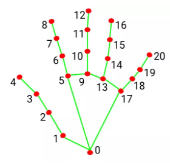

# python_UDP

建立時間: 2025年10月8日 下午5:26

[https://liaoxuefeng.com/books/python/network/udp/index.html](https://liaoxuefeng.com/books/python/network/udp/index.html)

https://shengyu7697.github.io/python-udp-socket/

- 教學: server code
    
    ```python
    ##server
    import socket
    
    HOST = '0.0.0.0'
    PORT = 7000
    
    s = socket.socket(socket.AF_INET, socket.SOCK_DGRAM)
    s.bind((HOST, PORT))
    
    print('server start at: %s:%s' % (HOST, PORT))
    print('wait for connection...')
    
    while True:
        indata, addr = s.recvfrom(1024)
        print('----server----')
        print('recvfrom ' + str(addr) + ': ' + indata.decode())
    
        outdata = 'echo ' + indata.decode()
        s.sendto(outdata.encode(), addr)
    s.close()
    
    ```
    
- 教學: client code
    
    ```python
    ##client
    import socket
    HOST = '0.0.0.0'#(網站原本)
    # HOST = '127.0.0.1'   # 修改:127.0.0.1（同機測試）or  server 的實際 IP
    PORT = 7000
    server_addr = (HOST, PORT)
    
    s = socket.socket(socket.AF_INET, socket.SOCK_DGRAM)
    
    while True:
        print('####client####')
        outdata = input('please input message: ')
        print('sendto ' + str(server_addr) + ': ' + outdata)
        s.sendto(outdata.encode(), server_addr)
        
        indata, addr = s.recvfrom(1024)
        print('recvfrom ' + str(addr) + ': ' + indata.decode())
    
    ```
    



- `0.0.0.0` 代表「聽所有來源」，不是單一 IP。
- 收到了從(127.0.0.1, 49308)這個來源送來的資料。
    
    49308 是 client 暫時開的「隨機 port」（UDP 每次會用不同 port 傳送）。
    


UDP Client 的流程分為以下幾大步驟：

1. 建立 socket：`s = socket.socket(socket.AF_INET, socket.SOCK_DGRAM)`
2. 傳送資料：`s.sendto()`
3. 接收資料：`s.recvfrom()`